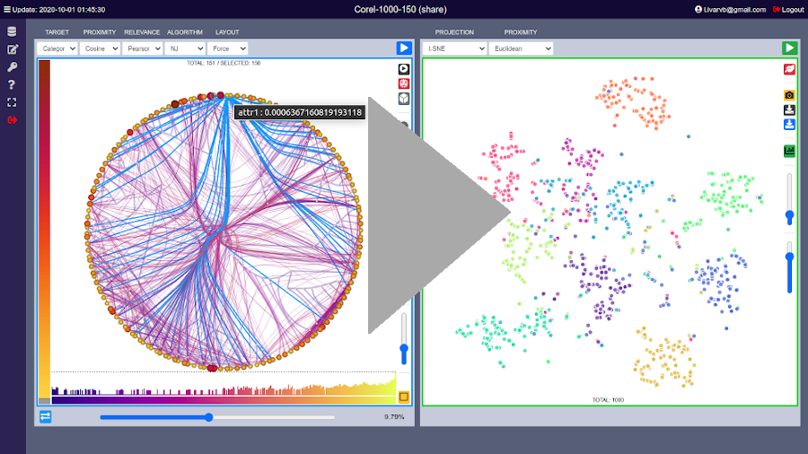

# GFF
This code is a new framework for feature analysis where a graph/tree layout is used to represent and explore patterns in features. The methodology is explained in the article "Graphs from Features: Tree-based Graph Layout for Feature Analysis" that is available at [Algorithms Journal](https://www.mdpi.com/1999-4893/13/11/302).

## Authors
Rosane Minghim, Liz Huancapaza, Erasmo Artur, Guilherme P. Telles and Ivar V. Belizario

## Prerequisites
From Linux or Windows, verify whether the following software are installed:
* [MongoDB](https://www.mongodb.com/docs/manual/administration/install-community/) - 4.4+;
* [Docker](https://www.docker.com/get-started) - 19.03.14+;
* [GCC](https://gcc.gnu.org/) - C/C++;
* [Python](https://www.python.org/) - Python 3.8+;
* [Chrome](https://www.google.com/chrome/) - Chrome 85.0.4183+;

## Running with docker (making a local image) :new:
### From Ubuntu, Windows or Mac run:
* docker build -t gffos . 
* docker run -d -it -v "$(pwd)":/app/gff  -p 8000:8000 gffos
* open the webbrowser with the url: http://localhost:8000/
* please login with user: **localuser** and password: **gff**
> obs.: run "docker build -t gffos ." only once

> obs.: run "docker stop id" to stop the gff application

> obs.: run "docker start id" to start the gff application

> obs.: id is dinamicaly asingned, use "docker ps" to see id

> obs.: from Ubuntu use sudo for each command

<!-- 
## Running with docker (using an image) :new:
### From Ubuntu, Windows or Mac run:
* docker import https://github.com/ivarvb/GFFOS/raw/master/gffos.tar
* docker run -d -it -v "$(pwd)":/app/gff  -p 8000:8000 gffos
* open the webbrowser with the url: http://localhost:8000/
* docker stop id
> obs.: run "sudo docker import gff.tar" only once

> obs.: id is dinamicaly asingned, use "docker ps" to see id

> obs.: from Ubuntu use sudo for each command -->

## [Running directly](#running-directly)
### From Ubuntu 20.04:
* [install MongoDB](https://www.mongodb.com/docs/manual/tutorial/install-mongodb-on-ubuntu/)
* run: bash GFF.sh install
* run: bash GFF.sh
* please login with user: localuser and password: gff
> obs.: don't forget to install MongoDB first.

<!-- From Ubuntu run in termninal:
* run.bat -->

## Getting started
* Upload some CSV file data set and begin to explore:
  

## Sample data sets
We have included two sample data sets that can help you to get started within the framework. The data sets are:

* [MNIST](http://yann.lecun.com/exdb/mnist): [download](dataset/MNIST-10000-784.csv)
  * Content: Handwritten digits features
  * 784 features; 10,000 items
  * Target feature: label

* [Corel Images](https://ieeexplore.ieee.org/document/1227984):  [download](dataset/Core-1000-150.csv)
  * Content: Extracted image features
  * 150 features; 1000 items
  * Target feature: Category

## Citation
<pre><code>
@Article{minghim2020gff,
AUTHOR = {Minghim, Rosane and Huancapaza, Liz and Artur, Erasmo and Telles, Guilherme P. and
Belizario, Ivar V.},
TITLE = {Graphs from Features: Tree-Based Graph Layout for Feature Analysis},
JOURNAL = {Algorithms},
VOLUME = {13},
YEAR = {2020},
NUMBER = {11},
ARTICLE-NUMBER = {302},
URL = {https://www.mdpi.com/1999-4893/13/11/302},
ISSN = {1999-4893},
ABSTRACT = {Feature Analysis has become a very critical task in data analysis and
visualization. Graph structures are very flexible in terms of representation and may encode
important information on features but are challenging in regards to layout being adequate
for analysis tasks. In this study, we propose and develop similarity-based graph layouts
with the purpose of locating relevant patterns in sets of features, thus supporting feature
analysis and selection. We apply a tree layout in the first step of the strategy, to
accomplish node placement and overview based on feature similarity. By drawing the
remainder of the graph edges on demand, further grouping and relationships among features
are revealed. We evaluate those groups and relationships in terms of their effectiveness in
exploring feature sets for data analysis. Correlation of features with a target categorical
attribute and feature ranking are added to support the task. Multidimensional projections
are employed to plot the dataset based on selected attributes to reveal the effectiveness
of the feature set. Our results have shown that the tree-graph layout framework allows for
a number of observations that are very important in user-centric feature selection, and not
easy to observe by any other available tool. They provide a way of finding relevant and
irrelevant features, spurious sets of noisy features, groups of similar features, and
opposite features, all of which are essential tasks in different scenarios of data
analysis. Case studies in application areas centered on documents, images and sound data
demonstrate the ability of the framework to quickly reach a satisfactory compact
representation from a larger feature set.},
DOI = {10.3390/a13110302}
}</code></pre>
